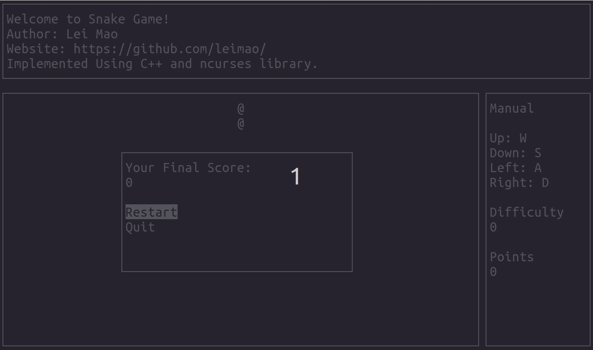

# Console Snake

Lei Mao

## Introduction

The Console Snake was implemented using C++ and the libraries `libncurses` and `libcplayer`. `libncurses` (new curses) is a programming library providing an application programming interface (API) that allows the programmer to write text-based user interfaces in a terminal-independent manner. [`libcplayer` (console player)]((https://github.com/leimao/Console_Player)) is a C++ library for playing background sound asynchronously in C++ programs.

## Dependencies

* CMake 3.0.0+
* libncurses 6.1+
* [libcplayer 0.0.1](https://github.com/leimao/Console_Player)

## Usages

### Installation of Dependencies

```bash
$ sudo apt-get install libncurses-dev cmake
```

### Installation of the Game

Because the installation requires to use `git submodule`, please `git clone` instead of `download` the repository.

```bash
$ git clone https://github.com/leimao/Console_Snake.git
$ cd Console_Snake
$ git submodule update --init --recursive
$ mkdir -p build
$ cd build
$ cmake ..
$ make
$ make install
```

### Running the Game

#### Playing the Game Using Default BGM

```bash
$ cd bin/
$ ./main
```

#### Playing the Game Using Custom BGM

The user is also allowed to use custom BGMs.

```bash
$ cd bin/
$ ./main [bgm_sound_file]
```

Currently the game only supports `wav`, `ogg`, and `flac` audio formats.

### Demo



## References

* [CMake Dependency Handling](https://foonathan.net/2016/07/cmake-dependency-handling/)
* [Royalty Free Game BGM - Better Sounds](https://opengameart.org/content/better-sounds-nes-version)

## To-Do List

- [ ] Add record board
- [x] Add background music

